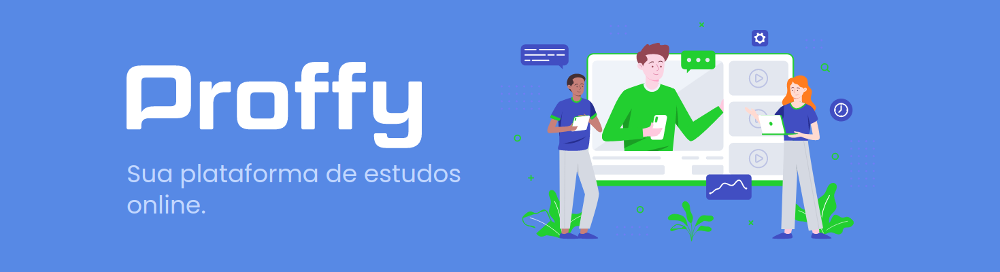

`#react` &nbsp; `#react-native` &nbsp; `#rocketseat` &nbsp; `#nlw` &nbsp; `#learning`
<!-- Title -->
Trilha **OMNISTACK**

  

   
  
  

 

[Introdução](#\#introdução) | [Tecnologias](#\#tecnologias) | [Screenshots](#\#screenshots) | [Diferenciais e Aprimoramentos](#\#diferenciais-e-aprimoramentos) | [Comandos](#\#comandos)

## \#Introdução

 &nbsp;&nbsp;&nbsp;&nbsp;O Proffy é uma plataforma (fictícia) para aprender e ensinar. É um lugar onde professores cadastram suas aulas particulares, bem como os preços e o conteúdo, e assim alunos podem encontra-los e contratar seus serviços.

## \#Tecnologias

O projeto é desenvolvido utilizando o conceito de SPA (Single Page Application) através da utilização, principalmente, do **`React`**. Com um backend **`NodeJS`** e integração do **`Express`** para facilitar as transações HTTP, além do **`SQLite3`** e **`Knex`** para o banco de dados.

> Tomei a liberdade de utilizar as fotos e os nomes de seguidores do GitHub para popular o banco de dados, caso tenha alguma objeção, favor postar um [ISSUE](https://github.com/euaaron/NLW2/issues) ou entrar em contato comigo de alguma outra forma.

## \#Screenshots

Em breve

## \#Diferenciais e Aprimoramentos

Em breve

## \#Comandos

Em breve

---

# NEXT LEVEL WEEK 2

Faala devs!

Nesse repositório estarei postando o conteúdo que estarei desenvolvendo durante as aulas da [Next Level Week 2](https://nextlevelweek.com/), evento gratuito oferecido pela [Rocketseat](https://rocketseat.com.br/), durante os dias 3 a 9 de agosto. (Opa! estendido até dia 14 😁)

> Se você tem interesse por front-end, e quer começar nessa área ou já tem conhecimento mas ainda não se sente seguro, está cansado de estudar o básico html, css e js, já pensou em aprender algum framework, ou uma stack, mas não sabe qual escolher ou por onde começar. Corre lá e se inscreve pra participar dessa semana incrível onde aprenderemos tudo oq é preciso para que o nosso conhecimento vá para o próximo nível! (Depois do dia 14/08/2020 os vídeos só estarão disponíveis para Alumni da Rocketseat)

## Os Branchs deste Repo

O evento possuí duas "trilhas", cada uma direcionada para um nível de experiência diferente, a trilha **Discovery** para iniciantes, e a **Omnistack** para os mais experientes.
Por este motivo, criei uma branch para cada trilha, onde estarei fazendo OS DOIS CAMINHOS. Como o **Omnistack** é o mais "completo" deixei ele como branch principal.

Eu sei Diego... vc falou pra n fazer isso... Mas mesmo tendo um conhecimento relativamente intermediário alto, ainda tenho inseguranças de n saber bem o básico. Então quero fazer os dois para não sentir mais isso. Começando pelo mais difícil, lógico... kkkkk